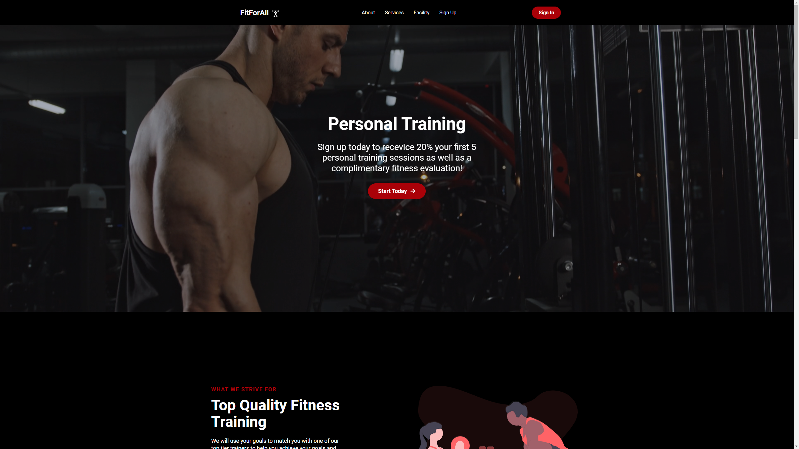
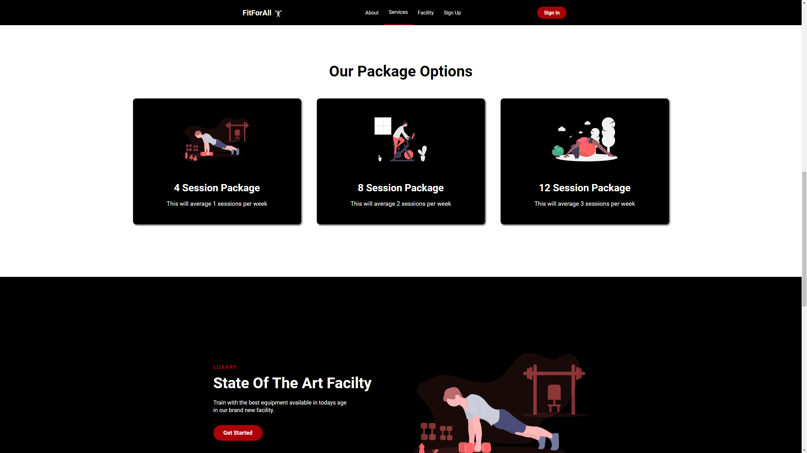
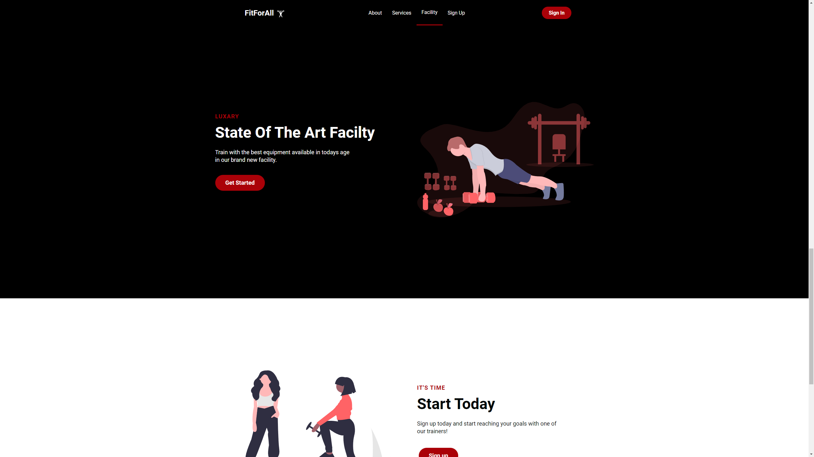

# Project Title

FitForAll

## Demo link:

<!-- Access my site at [google.com](https://google.com) -->

## About The App

[FitForAll] is a Personal training mobile responsive website advertising its self about its services and facility. this website has multiple pages linking to different parts of information.

## Screenshots

## Technologies

  &nbsp;
  &nbsp;
  &nbsp;
  &nbsp;

  

## Approach

Built with React and styled with styled components with react-scroll for smooth navigation and react-icons. 
